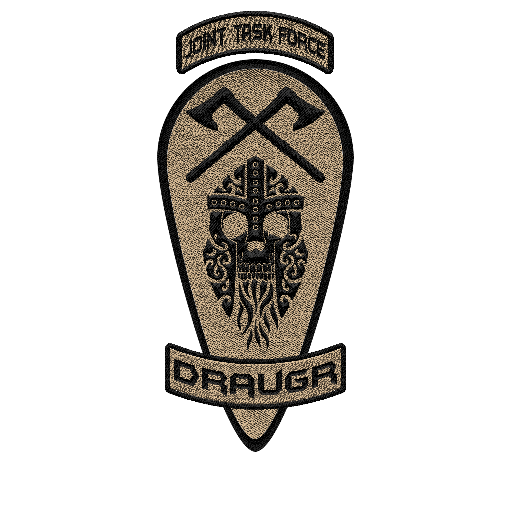

<p align="center">
  
</p>

# Ratatoskr

Event scheduling and attendance tracking bot for Joint Task Force Drauger's Fluxer community.

Part of the [Bragi](https://github.com/the-alphabet-cartel/bragi) bot infrastructure.

---

## What Ratatoskr Does

Named for the squirrel that carries messages up and down the world tree Yggdrasil, Ratatoskr coordinates military operations for the JTF Drauger Arma 3 MilSim community. Command Staff create events through a guided DM wizard, the bot posts a formatted operation briefing to the designated channel, and members RSVP by reacting with their unit's assigned emoji.

**Role-enforced signups.** Each reaction emoji is tied to a specific server role. If a Specialist tries to sign up under the Operator reaction, Ratatoskr removes it — members can only RSVP under their own unit. Anyone can react Declined regardless of role.

**Live attendance roster.** The event message updates in real time as members sign up or withdraw. Each unit section shows a count and lists every attending member by their server nickname (which carries their rank prefix).

**Channel guard.** The event channel stays clean — any message not posted by the bot is automatically deleted. Commands typed in the event channel are processed and then removed.

**Full lifecycle management.** Events can be edited or deleted by the creator or any Command Staff member. The bot sends DM reminders 15 minutes before an operation and automatically removes event posts 24 hours after the scheduled time.

---

## How It Works

### Creating an Event

1. A user with the **Command Staff** role types `!event` in any channel
2. Ratatoskr deletes the command message and DMs the user a creation wizard:
   - **Step 1:** Operation name
   - **Step 2:** Operation description / briefing
   - **Step 3:** Operation time (natural language, 24-hour format)
3. Ratatoskr posts the formatted event to the configured event channel
4. Ratatoskr seeds the post with all configured role emoji reactions plus the Declined (❌) reaction
5. The creator receives a DM confirmation with a link to the posted event

### Signing Up

1. A member reacts to an event post with their unit's emoji
2. Ratatoskr checks the member's server role against the reaction
3. If the role matches, the member is added to the roster and the event message is updated
4. If the role does not match, the reaction is silently removed
5. A member can switch from their unit reaction to Declined (or vice versa) — the bot handles the swap automatically

### Managing Events

| Command | Permission | Description |
|---------|------------|-------------|
| `!event` | Command Staff | Start the event creation wizard via DM |
| `!edit <id>` | Creator or Command Staff | Edit an existing event's title, description, or time |
| `!delete <id>` | Creator or Command Staff | Delete an event (with DM confirmation) |

---

## Configuration

Ratatoskr uses the Bragi three-layer config stack:

```
roles_config.json     ← role/emoji mapping (committed, hot-reloadable)
default_config.json   ← structural defaults (committed)
      ↓
.env                  ← runtime overrides (not committed)
      ↓
Docker Secrets        ← sensitive values (never in source)
```

### Environment Variables

Copy `.env.template` to `.env` and configure:

| Variable | Default | Description |
|----------|---------|-------------|
| `LOG_LEVEL` | `INFO` | DEBUG, INFO, WARNING, ERROR, CRITICAL |
| `LOG_FORMAT` | `human` | `human` (colorized) or `json` (structured) |
| `LOG_CONSOLE` | `true` | Enable console logging |
| `RATATOSKR_LOG_FILE` | — | Optional log file path |
| `COMMAND_PREFIX` | `!` | Prefix for staff commands |
| `RATATOSKR_GUILD_ID` | — | Fluxer guild ID (**required**) |
| `EVENT_CHANNEL_ID` | — | Channel where events are posted (**required**) |
| `COMMAND_STAFF_ROLE_ID` | — | Role that can create/manage events (**required**) |
| `DB_PATH` | `/data/ratatoskr.db` | SQLite database path inside container |
| `PUID` | `1000` | Container user ID |
| `PGID` | `1000` | Container group ID |

### Docker Secrets

| Secret | File | Description |
|--------|------|-------------|
| `ratatoskr_token` | `secrets/ratatoskr_fluxer_token` | Fluxer bot token |

### Role Configuration

`src/config/roles_config.json` maps server roles to signup emoji. Edit this file as units are added or removed:

```json
{
    "signup_roles": [
        {
            "key": "operator",
            "label": "Operator",
            "emoji": "🇦",
            "role_id": "your_role_snowflake",
            "max_slots": null
        }
    ],
    "declined": {
        "label": "Declined",
        "emoji": "❌"
    }
}
```

Each entry defines a signup category. The array order determines display order in event posts. `role_ids_accepted` (optional array) allows a single category to accept multiple roles — useful for combined sections like EL+TL.

---

## Deployment

### Prerequisites

- Docker Engine 29.x + Compose v5
- A Fluxer bot application with a token
- The `bragi` Docker network: `docker network create bragi`
- Host directories created:
  ```
  mkdir -p /opt/bragi/bots/ratatoskr/logs
  mkdir -p /opt/bragi/bots/ratatoskr/data
  ```

### Setup

```bash
# 1. Clone the repo
git clone https://github.com/the-alphabet-cartel/ratatoskr.git
cd ratatoskr

# 2. Copy and configure environment
cp .env.template .env
# Edit .env — set RATATOSKR_GUILD_ID, EVENT_CHANNEL_ID, and COMMAND_STAFF_ROLE_ID

# 3. Configure role-to-emoji mapping
# Edit src/config/roles_config.json — set role_id for each unit

# 4. Create the bot token secret
mkdir -p secrets
printf 'your-token-here' > secrets/ratatoskr_fluxer_token
chmod 600 secrets/ratatoskr_fluxer_token

# 5. Deploy
docker compose up -d
```

### Fluxer Bot Permissions

| Permission | Why |
|------------|-----|
| View Channels | Read messages in all channels (command detection) |
| Read Message History | Access existing messages for reaction tracking |
| Send Messages | Post events and reply to commands |
| Manage Messages | Delete non-event messages in the event channel |
| Add Reactions | Seed event posts with role emoji |
| Manage Reactions | Remove invalid reactions from event posts |

The bot's role must be positioned **above** all signup roles in the Fluxer role hierarchy.

---

## Event Post Format

Events are posted as formatted text messages with emoji-keyed attendance sections:

```
═══════════════════════════════════════
📋 Operation Enduring West — Phase 11 & Phase 12

NDI have held this region's international airport
and heavily fortified it...

⏰ Time
Sunday, March 01, 2026 14:00
⏳ in 2 days

───────────────────────────────────────
🇦 Operator (2)
  [PFC] Redcoat
  [PFC] Kebab

🇧 Specialist (4)
  [Cpl] Steel Beater
  [PFC] Kawkakodza
  [HA] Charlie
  [LCpl] Papa_PistOla

...

❌ Declined (1)
  [HA] Saiun

Created by [Maj]Beserk
═══════════════════════════════════════
```

Member names are pulled from server nicknames, which carry rank prefixes (e.g., `[PFC]`, `[Sgt]`, `[Maj]`). Sections with no signups display a dash (—). Counts update in real time as members react.

---

## Project Structure

```
ratatoskr/
├── docker-compose.yml            ← Container orchestration
├── Dockerfile                    ← Multi-stage build (Rule #10)
├── docker-entrypoint.py          ← PUID/PGID + tini (Rule #12)
├── .env.template                 ← Config reference (committed)
├── requirements.txt              ← fluxer-py + aiosqlite + python-dateutil
├── images/
│   └── Ratatoskr-PFP.png        ← Bot profile picture
├── secrets/
│   ├── README.md                 ← Setup instructions (committed)
│   └── ratatoskr_fluxer_token   ← Bot token (gitignored)
├── docs/
│   └── design.md                 ← Full design specification
└── src/
    ├── main.py                   ← Entry point + event dispatcher
    ├── config/
    │   ├── default_config.json   ← General defaults (Rule #4)
    │   └── roles_config.json     ← Role-to-emoji mapping
    ├── handlers/
    │   ├── event_create.py       ← DM-based event creation wizard
    │   ├── event_manage.py       ← !edit and !delete commands
    │   ├── reaction_handler.py   ← Reaction add/remove + role enforcement
    │   ├── channel_guard.py      ← Delete non-event messages
    │   └── reminder.py           ← Background task: 15-min DM reminders
    ├── managers/
    │   ├── config_manager.py           ← Three-layer config (Rule #7)
    │   ├── logging_config_manager.py   ← Colorized logging (Rule #9)
    │   └── database_manager.py         ← SQLite via aiosqlite
    ├── models/
    │   ├── event.py              ← Event data model
    │   └── signup.py             ← Signup/attendance data model
    └── utils/
        ├── time_parser.py        ← Natural language → datetime (24hr)
        └── event_formatter.py    ← Renders event post text
```

---

## Technical Notes

Ratatoskr uses a **command-first dispatcher** with a channel guard, extending the pattern established by Prism:

- Messages in the event channel from non-bot users are **deleted immediately**, then checked for commands.
- Messages starting with `!` are routed to the appropriate command handler. Non-command messages outside the event channel are ignored.
- `on_reaction_add` and `on_reaction_remove` events drive the attendance system. The bot distinguishes its own programmatic reaction removals from user-initiated ones using an in-memory pending-removal set to prevent infinite loops.

**Data persistence** uses SQLite via `aiosqlite` for non-blocking database operations. Events and signups survive bot restarts. The database is stored on a Docker volume mounted at `/data/`.

**Time parsing** accepts natural language input in 24-hour format (military time) via `python-dateutil`. Inputs like "Sunday, March 1, 2026 14:00", "next Sunday 19:30", or "2026-03-01 14:00" are all valid. Times in the past are rejected with a helpful error message.

**Background tasks** run on async loops: reminders check every 60 seconds for events starting within 15 minutes, and cleanup checks every 15 minutes for events that ended more than 24 hours ago.

See [docs/design.md](docs/design.md) for the full design specification including database schema, reaction handling edge cases, and risk register.

---

## Charter Compliance

| Rule | Status |
|------|--------|
| #1 Factory Functions | ✅ All managers use `create_*()` |
| #2 Dependency Injection | ✅ All managers accept deps via constructor |
| #3 Additive Development | ✅ |
| #4 JSON Config + Secrets | ✅ Three-layer stack + roles_config.json |
| #5 Resilient Validation | ✅ Fallbacks with logging |
| #6 File Versioning | ✅ All files versioned |
| #7 Config Hygiene | ✅ Secrets/env/JSON separated |
| #8 Real-World Testing | ⬜ Pending Fluxer stabilization |
| #9 LoggingConfigManager | ✅ Standard colorization |
| #10 Python 3.12 + Venv | ✅ Multi-stage Docker build |
| #11 File System Tools | ✅ |
| #12 Python Entrypoint + tini | ✅ PUID/PGID support |

---

## Dependencies

| Package | Purpose |
|---------|---------|
| [fluxer-py](https://github.com/akarealemil/fluxer.py) | Fluxer bot library |
| [aiosqlite](https://github.com/omnilib/aiosqlite) | Async SQLite for event/signup persistence |
| [python-dateutil](https://github.com/dateutil/dateutil) | Natural language date/time parsing |
| [pytz](https://github.com/stub42/pytz) | Timezone handling |

---

## Naming

Ratatoskr is the squirrel in Norse mythology that runs up and down Yggdrasil, the world tree, carrying messages between the eagle at the top and the serpent at the roots. As the scheduling bot, Ratatoskr carries operation briefings from Command Staff to the community and ferries attendance confirmations back — the messenger that keeps the unit coordinated.

---

<p align="center"><br /><b>For The Fun Of It</b></p>
